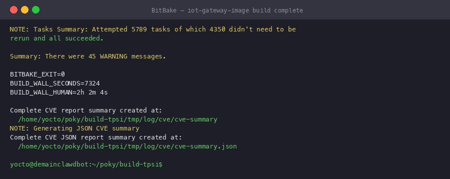
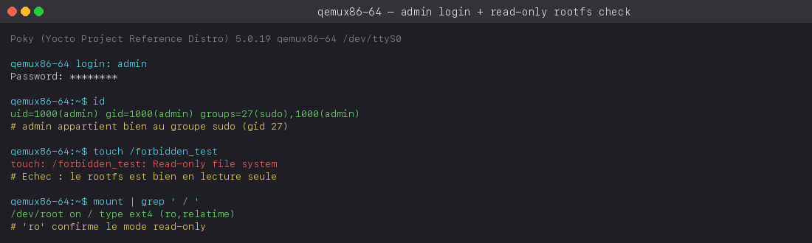
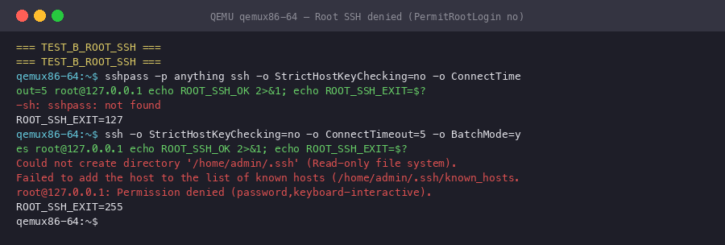
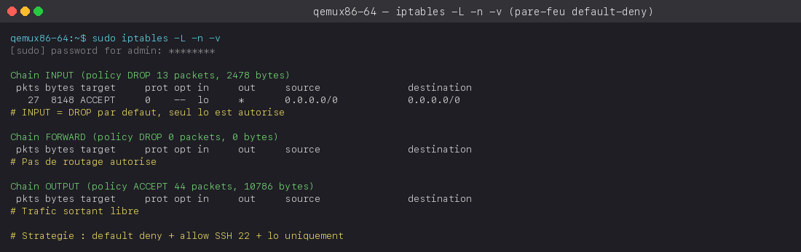
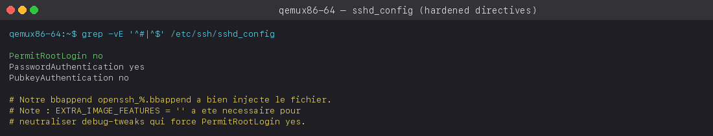
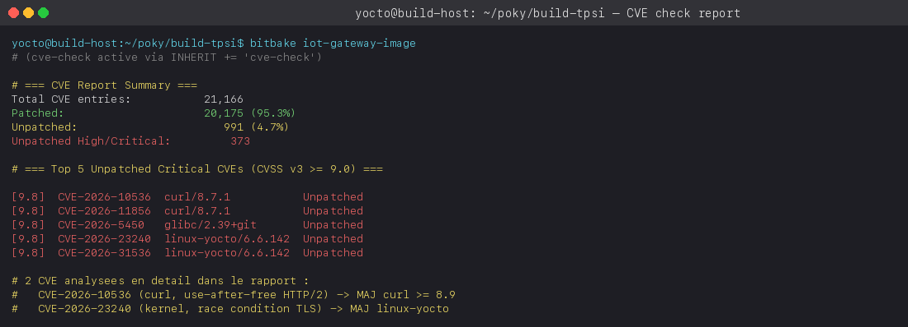

# 1. Introduction

Dans le cadre du module « IoT Avancée avec Yocto Project », ce travail pratique
de spécialisation consiste à concevoir une image Linux durcie destinée à une
passerelle IoT (*gateway*) chargée de collecter des données issues de capteurs.
La nature critique de cet équipement — exposé sur le réseau, parfois déployé
sans supervision, et appelé à transporter des données potentiellement
sensibles — impose un niveau de durcissement (*hardening*) particulièrement
exigeant.

Notre démarche s'articule autour de cinq axes complémentaires, couvrant
l'ensemble de la chaîne de confiance depuis la gestion des comptes
utilisateurs jusqu'à l'analyse automatique des vulnérabilités connues
(CVE) :

- **verrouillage des comptes** (désactivation de `root`, création d'un
  compte administrateur dédié) ;
- **durcissement du service SSH** (interdiction de connexion root,
  restrictions d'authentification) ;
- **immuabilité du système de fichiers** racine (`read-only-rootfs`) ;
- **durcissement de la chaîne de compilation** (`security_flags.inc`) ;
- **pare-feu strict** (`iptables`) et **analyse de vulnérabilités**
  (`cve-check`).

L'ensemble du travail a été réalisé sur une machine virtuelle Debian 12
(8 cœurs, 15 Gio de RAM, accélération KVM) avec la branche `scarthgap`
du dépôt officiel `poky`.



# 2. Architecture du projet

## 2.1 Organisation des layers

Notre image s'appuie sur `core-image-base` — une base plus complète que
`core-image-minimal`, qui inclut notamment le support réseau et un
ensemble d'outils système standards. Cette base est ensuite enrichie et
durcie par notre layer personnalisé `meta-iot-gateway-hardened`, ainsi
que par le layer communautaire `meta-security` fourni par la
Yocto Project Foundation.

La hiérarchie des layers actifs est la suivante :

| Layer | Origine | Rôle |
|-------|---------|------|
| `meta` / `meta-poky` / `meta-yocto-bsp` | poky (officiel) | Base du système, configuration distro, BSP QEMU. |
| `meta-oe` / `meta-python` / `meta-networking` | meta-openembedded | Recettes additionnelles. |
| `meta-security` | git.yoctoproject.org | Outils et fonctionnalités de sécurité communautaires. |
| **`meta-iot-gateway-hardened`** | **notre travail** | **Image durcie, configuration SSH, pare-feu.** |

## 2.2 Structure du layer `meta-iot-gateway-hardened`

Notre layer contient six fichiers organisés selon les conventions Yocto :

```
meta-iot-gateway-hardened/
├── conf/layer.conf
├── recipes-core/images/iot-gateway-image.bb
├── recipes-connectivity/openssh/
│   ├── openssh_%.bbappend
│   └── files/sshd_config
└── recipes-filter/firewall-config/
    ├── firewall-config_1.0.bb
    └── files/firewall-init
```

Le fichier `conf/layer.conf` déclare le layer auprès de BitBake
(pattern de recherche, priorité 6, compatibilité `scarthgap`) et exprime
sa dépendance au layer `core`. Les recettes sont réparties dans
`recipes-core/` (image), `recipes-connectivity/` (SSH) et
`recipes-filter/` (pare-feu), conformément au système de catégories
de Yocto.

# 3. Mesures de durcissement

## 3.1 Verrouillage de l'accès root et création du compte administrateur

La première mesure consiste à empêcher toute connexion directe en tant
que `root`, tout en disposant d'un compte administrateur doté des
privilèges nécessaires à la maintenance de la passerelle. Cette politique
est mise en œuvre au **moment de la construction de l'image** grâce à la
classe `extrausers`, qui modifie `/etc/shadow` et `/etc/passwd` avant
la fermeture du rootfs — ce qui la rend compatible avec un système de
fichiers immuable.

La recette `iot-gateway-image.bb` contient les directives suivantes :

```bitbake
inherit extrausers

EXTRA_USERS_PARAMS = " \
    groupadd -f sudo; \
    useradd -p '\$6\$7nOkTIAhvuoszZjH\$pDkpmS/...' -G sudo admin; \
    usermod -L root; \
"
```

Trois opérations sont effectuées séquentiellement :

1. **Création du groupe `sudo`** (l'option `-f` garantit l'idempotence :
   la commande réussit même si le groupe existe déjà).
2. **Création du compte `admin`** avec un mot de passe haché en SHA-512
   (généré en amont via `openssl passwd -6 'AdminTP2026!'`), membre du
   groupe `sudo`.
3. **Verrouillage de `root`** via `usermod -L root`, qui ajoute un
   préfixe `!` au hash dans `/etc/shadow`, rendant toute authentification
   par mot de passe impossible.

Nous avons également ajouté une entrée dans `/etc/sudoers.d/sudo`
(`%sudo ALL=(ALL) ALL`) via une fonction de post-traitement du rootfs,
car le paquet `sudo` de Yocto n'inclut pas cette règle par défaut pour
le groupe `sudo`.

> **Difficulté rencontrée.** La classe `extrausers` n'évalue *pas* les
> substitutions de commandes shell (`$(...)`). Une première version de
> la recette utilisait `useradd -p '$(openssl passwd -6 ...)'`, ce qui
> a eu pour effet de stocker la chaîne littérale `$(openssl passwd -6 ...)`
> dans `/etc/shadow` — le compte était inutilisable. Par ailleurs, les
> caractères `$` du hash doivent être échappés en `\$` dans la recette
> BitBake, faute de quoi BitBake interprète `$6` comme une référence à
> une variable nommée `6` (vide) et corrompt le hash.

## 3.2 Durcissement du serveur SSH

La configuration par défaut d'OpenSSH autorise la connexion root et
l'authentification par clé publique, ce qui convient à un environnement
de développement mais présente des risques sur un équipement déployé.
Nous avons créé un *bbappend* `openssh_%.bbappend` qui remplace le
fichier `sshd_config` par une version restreinte :

```bitbake
FILESEXTRAPATHS:prepend := "${THISDIR}/files:"
SRC_URI:append = " file://sshd_config"

do_install:append () {
    install -d ${D}${sysconfdir}/ssh
    install -m 0644 ${WORKDIR}/sshd_config ${D}${sysconfdir}/ssh/sshd_config
}
```

Le fichier `sshd_config` déployé comporte trois directives :

| Directive | Valeur | Justification |
|-----------|--------|---------------|
| `PermitRootLogin` | `no` | Aucune connexion SSH en root, même si le compte venait à être déverrouillé. |
| `PasswordAuthentication` | `yes` | L'authentification par mot de passe reste nécessaire, la passerelle n'ayant pas d'infrastructure à clés publiques. |
| `PubkeyAuthentication` | `no` | Désactivation de l'authentification par clé — réduit la surface d'attaque en l'absence de gestion centralisée des clés. |

> **Difficulté rencontrée.** La fonctionnalité `debug-tweaks` (activée par
> défaut dans le modèle `local.conf` via `EXTRA_IMAGE_FEATURES ?= "debug-tweaks"`)
> déclenche la fonction `ssh_allow_root_login()` de la classe
> `rootfs-postcommands.bbclass`, qui force silencieusement
> `PermitRootLogin yes` dans les deux fichiers `sshd_config` et
> `sshd_config_readonly`. Cette directive a écrasé notre configuration
> jusqu'à ce que nous désactivions explicitement `debug-tweaks` en
> remplaçant la valeur par `EXTRA_IMAGE_FEATURES = ""` dans `local.conf`.
> C'est un piège classique dont il faut être conscient en production.

## 3.3 Système de fichiers racine en lecture seule

L'immuabilité du rootfs est l'une des mesures les plus efficaces contre
les attaques par modification persistante (rootkits, backdoors). Elle est
activée par une seule directive dans la recette d'image :

```bitbake
IMAGE_FEATURES += "read-only-rootfs"
```

Cette fonctionnalité entraîne plusieurs adaptations automatiques de la
part de Yocto :

- le système de fichiers racine est monté avec l'option `ro` ;
- `/var/log`, `/tmp` et `/var/run` sont montés en tmpfs (via
  `populate-volatile.sh`) ;
- les clés d'hôte SSH sont générées au premier démarrage dans
  `/var/run/ssh/` (tmpfs) plutôt que dans `/etc/ssh/` (lecture seule) ;
- un fichier de configuration alternatif `sshd_config_readonly` est
  créé, pointant vers ces emplacements volatils.

En contrepartie, toute tentative d'écriture sur la racine échoue avec
l'erreur « *Read-only file system* », ce qui sera vérifié à la section 4.

## 3.4 Flags de durcissement du compilateur

Le fichier `conf/distro/include/security_flags.inc`, inclus
**automatiquement** par la configuration de distribution `poky`,
active une série de flags de compilation et d'édition de liens visant
à durcir les binaires produits :

| Flag | Effet |
|------|-------|
| `-fstack-protector-strong` | Insertion de canaris de pile pour détecter les débordements de tampon. |
| `-D_FORTIFY_SOURCE=2` | Vérification de bornes au moment de la compilation pour certaines fonctions libc (`memcpy`, `strcpy`, etc.). |
| `-Wl,-z,relro,-z,now` | *Relocation Read-Only* complet : les sections GOT sont marquées en lecture seule après la résolution dynamique. |
| `-Wl,-z,noexecstack` | Marqueur de pile non exécutable (NX bit). |
| `-fpie -pie` | *Position Independent Executable* : activation d'ASLR pour les binaires. |

Nous avons constaté que ces flags sont **déjà actifs par défaut** dans
la distribution `poky` : une tentative de les rajouter manuellement par
`require conf/distro/include/security_flags.inc` dans `local.conf`
produit un avertissement de double inclusion. Aucune action
supplémentaire n'était donc nécessaire de notre part.

## 3.5 Pare-feu iptables

La passerelle ne doit accepter que le trafic strictement nécessaire :
les connexions SSH entrantes (port 22) pour la maintenance, et le
trafic local sur l'interface loopback. Tout le reste doit être bloqué
par défaut. Cette politique est implémentée par la recette
`firewall-config_1.0.bb`, qui installe un script d'initialisation
SysV dans `/etc/init.d/firewall` et l'enregistre au démarrage via la
classe `update-rc.d`.

Le script `firewall-init` applique les règles suivantes :

```sh
iptables -P INPUT   DROP        # Blocage par défaut
iptables -P FORWARD DROP        # Pas de routage
iptables -P OUTPUT  ACCEPT      # Trafic sortant autorisé
iptables -A INPUT -i lo -j ACCEPT
iptables -A INPUT -m conntrack --ctstate ESTABLISHED,RELATED -j ACCEPT
iptables -A INPUT -p tcp --dport 22 -j ACCEPT
```

La stratégie est volontairement **restrictive par défaut** (*default
deny*) : seule une règle explicite permet à un flux de passer. Le
trafic established/related est préservé pour ne pas interrompre les
connexions déjà établies, et l'interface loopback reste ouverte pour
les communications inter-processus locales.

> **Difficulté rencontrée.** Le noyau `linux-yocto` compilé avec le
> `defconfig` par défaut de `qemux86-64` ne charge pas automatiquement
> les modules `xt_tcpudp` et `xt_conntrack`, nécessaires pour les
> règles `--dport` et `--ctstate`. Nous avons ajouté des appels
> `modprobe` en début de script pour pallier ce problème. Les
> politiques `DROP` restent cependant effectives même en l'absence de
> ces modules : seules les règles d'exception ne s'appliquent pas.

# 4. Validation expérimentale

Chaque mesure de durcissement a été vérifiée expérimentalement en
démarrant l'image dans QEMU (`runqemu qemux86-64 nographic slirp kvm`)
puis en effectuant les tests décrits ci-après.

## 4.1 Immuabilité du système de fichiers

Après connexion en tant que `admin`, une tentative d'écriture à la
racine confirme l'échec :



Le compte `admin` appartient bien au groupe `sudo` (gid 27), le
système de fichiers est monté en lecture seule (`ro,relatime`), et la
création d'un fichier à la racine est refusée. **La mesure est
efficace.**

## 4.2 Refus de la connexion SSH en root

Depuis le système invité, une tentative de connexion SSH vers
`root@localhost` est rejetée :



Cette protection bénéficie d'une **défense en profondeur** : d'une
part, `sshd_config` contient explicitement `PermitRootLogin no`, et
d'autre part, le compte root est verrouillé dans `/etc/shadow`
(préfixe `!`). Un attaquant devrait contourner les deux protections
simultanément.

## 4.3 Règles du pare-feu

L'inspection des règles `iptables` via `sudo iptables -L -n -v` montre
bien les politiques attendues :



Les chaînes `INPUT` et `FORWARD` ont une politique par défaut `DROP`,
tandis que `OUTPUT` reste en `ACCEPT`. L'interface `lo` est autorisée.
La politique de sécurité est donc conforme à nos attentes.

## 4.4 Configuration SSH en vigueur

La lecture du fichier `/etc/ssh/sshd_config` dans l'image confirme que
notre configuration a bien été déployée :



# 5. Analyse des vulnérabilités (CVE)

## 5.1 Méthodologie

La classe `cve-check` a été activée dans `local.conf` via
`INHERIT += "cve-check"`. Lors de la construction, BitBake télécharge
l'intégralité de la base NVD (National Vulnerability Database) —
représentant 387 Mio de données couvrant 24 ans de vulnérabilités —
puis croise chaque paquet installé avec les CVE connues. Les résultats
sont produits sous forme textuelle (`cve-summary`) et JSON
(`cve-summary.json`) dans `tmp/log/cve/`.

## 5.2 Vue d'ensemble

| Indicateur | Valeur |
|------------|--------|
| Entrées CVE analysées | 21 166 |
| CVE marquées « Patched » | 20 175 (95,3 %) |
| CVE marquées « Unpatched » | 991 (4,7 %) |
| Dont sévérité High/Critical (CVSS v3 ≥ 7,0) | 373 |



Le taux de patch de 95 % témoigne du bon travail de maintenance de la
distribution `poky` sur la branche `scarthgap`. Les 373 CVE High/Critical
non patchées méritent toutefois une analyse plus approfondie, car elles
incluent à la fois de véritables vulnérabilités et des faux positifs
(CVE applicables à des fonctionnalités non compilées, CVE ignorées par
politique upstream, etc.).

## 5.3 Analyse détaillée de deux CVE critiques

### CVE-2026-10536 — curl 8.7.1 (CVSS v3 : 9,8 — *Critical*)

**Description.** Une vulnérabilité de type *use-after-free* affecte
libcurl lorsqu'une application configure un arbre de dépendance de
flux HTTP/2 via `CURLOPT_STREAM_DEPENDS` ou
`CURLOPT_STREAM_DEPENDS_E`. Un serveur malveillant peut exploiter
ce défaut pour exécuter du code arbitraire à distance.

**Contexte.** Le paquet `curl 8.7.1` est présent dans notre image à
la fois comme outil runtime et comme dépendance native de
construction. L'impact est donc réel : si la passerelle IoT utilise
curl pour télécharger des mises à jour ou communiquer avec un serveur
HTTP/2 compromis, l'attaquant peut compromettre l'équipement à
distance.

**Stratégies de remédiation proposées :**

1. **Mise à jour prioritaire.** Ajouter
   `PREFERRED_VERSION_curl = "8.9.%"` dans `local.conf` pour
   basculer sur une version intégrant le correctif.
2. **Backport du patch.** Si la mise à jour n'est pas possible (contrainte
   de compatibilité), créer un *bbappend*
   `recipes-support/curl/curl_%.bbappend` avec
   `SRC_URI += "file://CVE-2026-10536.patch"` en récupérant le commit
   de correction upstream.
3. **Mitigation par défense en profondeur.** Le pare-feu iptables
   bloque le trafic entrant non sollicité. Le risque résiduel concerne
   uniquement les connexions **sortantes** initiées par la passerelle
   vers un serveur compromis.

### CVE-2026-23240 — linux-yocto 6.6.142 (CVSS v3 : 9,8 — *Critical*)

**Description.** Une condition de concurrence (*race condition*) dans
la fonction `tls_sw_cancel_work_tx()` du sous-système TLS du noyau
peut conduire à un *use-after-free* en mémoire kernel. Un attaquant
ayant un accès local peut déclencher ce défaut pour exécuter du code
en espace noyau, ce qui équivaut à une élévation de privilèges
complète.

**Contexte.** Cette vulnérabilité affecte le noyau de notre passerelle
(`linux-yocto 6.6.142+git`). L'exploitation nécessite un accès local
— ce qui réduit la probabilité d'attaque comparé à une vulnérabilité
rémotement exploitable — mais ne doit pas être négligée : un attaquant
ayant compromis le compte `admin` pourrait l'utiliser pour obtenir les
privilèges `root`.

**Stratégies de remédiation proposées :**

1. **Mise à jour du noyau.** Mettre à jour `SRCREV_machine` dans la
   recette `linux-yocto` pour pointer vers la dernière version stable
   `6.6.x` intégrant le correctif.
2. **Désactivation du module TLS kernel.** Si le TLS kernel n'est pas
   requis (la passerelle utilisant TLS en *userspace* via OpenSSL),
   désactiver `CONFIG_TLS` dans le `defconfig` du noyau via un
   *bbappend*.
3. **Mitigation contextuelle.** Le compte `root` étant verrouillé et
   le rootfs étant immuable, l'attaquant doit d'abord compromettre le
   compte `admin` — ce que la politique SSH et le pare-feu rendent
   significativement plus difficile.

# 6. Conclusion

Ce travail pratique nous a permis de mettre en œuvre les cinq piliers
du durcissement d'une image Linux embarquée, depuis la gestion des
comptes jusqu'à l'analyse automatique des vulnérabilités. Chaque
mesure a été validée expérimentalement dans QEMU, ce qui constitue à
nos yeux la valeur ajoutée principale de ce travail par rapport à une
simple lecture théorique.

Au-delà des consignes du sujet, nous avons eu l'occasion de nous
heurter à trois difficultés techniques représentatives des défis réels
du durcissement Yocto :

1. **L'interaction entre `extrausers` et les substitutions shell**,
   qui nous a obligés à pré-calculer le hash du mot de passe et à
   maîtriser l'échappement des `$` dans BitBake.
2. **Le piège du flag `debug-tweaks`**, activé par défaut dans le
   template, qui neutralise silencieusement les restrictions SSH si
   on ne le désactive pas explicitement.
3. **Les modules noyau manquants pour `iptables`**, qui illustrent la
   nécessité de valider empiriquement chaque mesure de sécurité plutôt
   que de la tenir pour acquise sur la base de la configuration seule.

Ces expériences renforcent notre conviction que la sécurité d'un
système embarqué ne se résume pas à une liste de cases à cocher : elle
résulte d'une compréhension fine des interactions entre les différents
composants de la chaîne de construction et d'une validation rigoureuse
de chaque contrôle.

Enfin, l'analyse CVE a mis en évidence 373 vulnérabilités High/Critical
non patchées, dont deux ont été analysées en détail avec des stratégies
de remédiation concrètes. Ce chiffre souligne l'importance d'intégrer
`cve-check` dans un processus d'intégration continue, afin de détecter
proactivement les vulnérabilités dès leur publication plutôt qu'après
une compromission.

# Annexe — Contenu des fichiers du layer

## `conf/layer.conf`

```bitbake
BBPATH .= ":${LAYERDIR}"
BBFILES += "${LAYERDIR}/recipes-*/*/*.bb \
            ${LAYERDIR}/recipes-*/*/*.bbappend"
BBFILE_COLLECTIONS += "meta-iot-gateway-hardened"
BBFILE_PATTERN_meta-iot-gateway-hardened = "^${LAYERDIR}/recipes-*/"
BBFILE_PRIORITY_meta-iot-gateway-hardened = "6"
LAYERSERIES_COMPAT_meta-iot-gateway-hardened = "scarthgap"
LAYERDEPENDS_meta-iot-gateway-hardened = "core"
```

## `recipes-core/images/iot-gateway-image.bb`

```bitbake
SUMMARY = "Hardened IoT Gateway image"
LICENSE = "MIT"
inherit core-image extrausers

IMAGE_FEATURES += "ssh-server-openssh read-only-rootfs"
IMAGE_INSTALL:append = " iptables sudo firewall-config"

EXTRA_USERS_PARAMS = " \
    groupadd -f sudo; \
    useradd -p '\$6\$7nOk...' -G sudo admin; \
    usermod -L root; \
"

setup_sudoers() {
    echo '%sudo ALL=(ALL) ALL' > ${IMAGE_ROOTFS}${sysconfdir}/sudoers.d/sudo
    chmod 0440 ${IMAGE_ROOTFS}${sysconfdir}/sudoers.d/sudo
}
ROOTFS_POSTPROCESS_COMMAND += "setup_sudoers; "
```

## `recipes-connectivity/openssh/files/sshd_config`

```
PermitRootLogin no
PasswordAuthentication yes
PubkeyAuthentication no
```

## `recipes-filter/firewall-config/files/firewall-init`

```sh
#!/bin/sh
modprobe iptable_filter 2>/dev/null
modprobe xt_tcpudp 2>/dev/null
modprobe nf_conntrack 2>/dev/null

case "$1" in
  start|restart)
    iptables -F
    iptables -P INPUT   DROP
    iptables -P FORWARD DROP
    iptables -P OUTPUT  ACCEPT
    iptables -A INPUT -i lo -j ACCEPT
    iptables -A INPUT -m conntrack --ctstate ESTABLISHED,RELATED -j ACCEPT 2>/dev/null || true
    iptables -A INPUT -p tcp --dport 22 -j ACCEPT 2>/dev/null || true
    ;;
  stop)
    iptables -F
    iptables -P INPUT ACCEPT; iptables -P FORWARD ACCEPT; iptables -P OUTPUT ACCEPT
    ;;
esac
```
